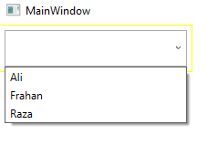

# ComboBoxAutoComplete WPF Control

ComboBoxAutoComplete is a custom WPF UserControl that enhances the functionality of the standard ComboBox by providing auto-complete and filtering features.

## Features
- Auto-complete functionality for easy data entry.
- Customizable filtering options.
- Sleek and user-friendly design.

## Getting Started

### Prerequisites
- .NET Core
- Visual Studio (or any compatible IDE)

### Installation
1. Clone the repository.
2. Add the `ComboBoxAutoComplete` control to your WPF project.
3. Or Use Sample.7z , Extract It and use it as sample

### Usage
1. Include the `ComboBoxAutoComplete` control in your XAML.
   ```xml
   <local:ComboBoxAutoComplete
      ItemsSource="{Binding YourItemsSource}"
      DisplayMemberPath="YourDisplayMemberPath"
      SelectedValuePath="YourSelectedValuePath"
      FilterMode="YourFilterMode"
      FontSize="YourFontSize"
      FontWeight="YourFontWeight"
      SelectionChanged="YourSelectionChangedHandler"/>

### ItemsSource: 
- Bind it to your collection of data that you want to display in the ComboBoxAutoComplete.

### DisplayMemberPath: 
- Specify the property of each item in the ItemsSource that should be displayed in the ComboBoxAutoComplete.

### SelectedValuePath: 
- Specify the property of each item in the ItemsSource that should be used as the selected value.

### FilterMode: 
- Choose the filtering mode for the auto-complete feature (AutoCompleteFilterMode.None, AutoCompleteFilterMode.Equals, AutoCompleteFilterMode.Contains, AutoCompleteFilterMode.StartsWith).

### FontSize: 
- Set the font size of the ComboBoxAutoComplete.

### FontWeight: 
- Set the font weight of the ComboBoxAutoComplete.

### SelectionChanged: 
- Handle this event to perform actions when the selection in the ComboBoxAutoComplete changes.

- Customize the control by adjusting properties like ItemsSource, DisplayMemberPath, SelectedValuePath, FilterMode, FontSize, FontWeight, and handle the SelectionChanged event.



## Youtube Tutorial
(https://www.youtube.com/watch?v=yxe3U_M55ts&t=406s)


or 

```xml
<dx:ThemedWindow x:Class="ULTRA_ERP_WPF.Modules.Views.DoubleEntryTransactionWindowDialog"
    xmlns="http://schemas.microsoft.com/winfx/2006/xaml/presentation"
    xmlns:x="http://schemas.microsoft.com/winfx/2006/xaml"
    xmlns:dx="http://schemas.devexpress.com/winfx/2008/xaml/core"
    xmlns:dxe="http://schemas.devexpress.com/winfx/2008/xaml/editors"
    xmlns:dxg="http://schemas.devexpress.com/winfx/2008/xaml/grid"
    xmlns:ssoft="clr-namespace:SaeediSoftWpfUiControls;assembly=SaeediSoftWpfUiControls"
    xmlns:local='clr-namespace:ULTRA_ERP_WPF.Modules.Views'
    Title="Account Transactions"
    Width="1200"
    Height="750"
    FontSize="20"
    Loaded="ThemedWindow_Loaded"
    Closing='ThemedWindow_Closing'
    PreviewKeyDown="ThemedWindow_PreviewKeyDown"
    WindowStartupLocation="CenterScreen"
    WindowState="Maximized">

<ssoft:ComboBoxAutoComplete x:Name="ucFromAccount"
	Width="134"
	Height="30"
	DisplayMemberPath="DisplayField"
	FilterMode="Contains"
	FontSize="12"
	PreviewKeyDown="fields_PreviewKeyDown" />

C# Code To Use More Than One Controls In Same Page 
   private async void loadAccountsToUi()
        {
            ObservableCollection<SearchModel> dataList = new() { };
            ObservableCollection<SearchModel> dataList2 = new() { };
            ObservableCollection<SearchModel> dataListLineItems = new() { };
            var accounts = _service.Account.GetSubAccounts();
            accountListForSelection = accounts;
            var lineItems = await _service.LineItem.GetAll().Where(m => m.IsDeleted == false).ToListAsync();
            lineItemsListForSelection = lineItems;

            foreach (var item in accounts)
            {
                dataList.Add(new SearchModel()
                {
                    DisplayField = item.Title,
                    ValueFieldGuidId = item.GuidId,
                    StringFeild1 = item.Title,
                    StringFeild2 = item.DiaryNumber,
                });
            }

            foreach (var item in accounts)
            {
                dataList2.Add(new SearchModel()
                {
                    DisplayField = item.Title,
                    ValueFieldGuidId = item.GuidId,
                    StringFeild1 = item.Title,
                    StringFeild2 = item.DiaryNumber,
                });
            }

            foreach (var item in lineItems)
            {
                dataListLineItems.Add(new SearchModel()
                {
                    DisplayField = item.ItemName,
                    ValueFieldGuidId = item.GuidId,
                    StringFeild1 = item.ItemName,
                });
            }

            ucFromAccount.ItemsSource = dataList;
            ucToAccount.ItemsSource = dataList2;
            ucLineItem.ItemsSource = dataListLineItems;

            cboxLinkedAccounts.ItemsSource = _service.Account.GetCommonCashSubAccounts();
            await Task.Delay(300);
            cboxLinkedAccounts.SelectedIndex = 0;
        }

        //new